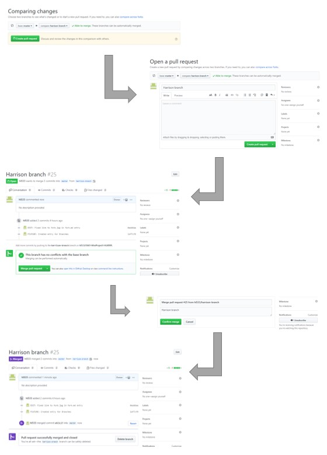

# Merge –

>“Git merge merges lines of development together. This command is typically used to combine changes made on two distinct branches. For example, a developer would merge when they want to combine changes from a feature branch into the master branch for deployment.

>Now that your changes have been verified in production, it is time to merge your code into the master branch.
>
>Once merged, Pull Requests preserve a record of the historical changes to your code. Because they're searchable, they let anyone go back in time to understand why and how a decision was made.”

The merge function is used in a project where different branches are being used in a repository. Once a branch's changes have been verified, a pull request is submitted and approved, and the merge to the 'destination' branch is allowed to proceed. Often, this is to 'merge' changes from a feature branch to a master branch, like is being done in this project.

The merge can either be done through a command in the terminal/git bash or in GitHub.

The command for merging is:
```git merge <branchwithnewchanges>```
#note that the 'destination' or 'master' branch has to be the currently selected branch, accomplished using the ```git checkout``` command

In GitHub, it is done in the following steps:


[https://guides.github.com/introduction/git-handbook/](https://guides.github.com/introduction/git-handbook/)
[https://guides.github.com/introduction/flow/](https://guides.github.com/introduction/flow/)
